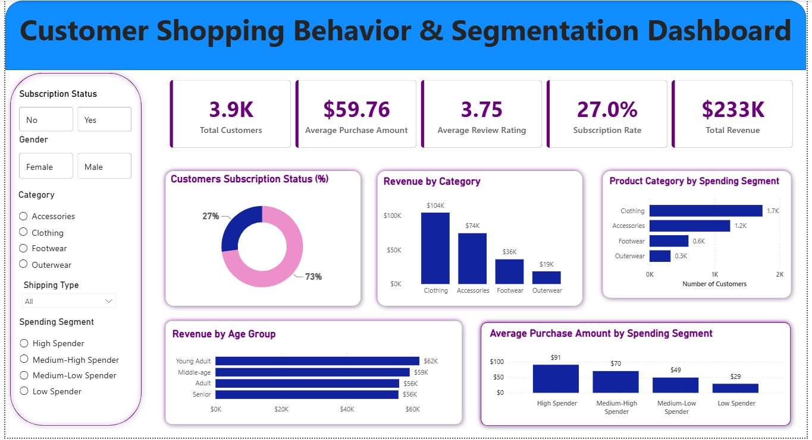

# Customer Shopping Behavior & Segmentation Analysis

## Project Overview

This end-to-end data analytics project analyzes customer shopping behavior to identify purchasing patterns, customer segments, product performance, subscription behavior, and revenue trends.

The project began with a raw customer shopping dataset containing 3,900 customer records. Python and Pandas were used in Jupyter Notebook for data inspection, cleaning, transformation, and feature engineering. The prepared dataset was then loaded into MySQL, where SQL queries were used to investigate customer behavior, revenue performance, product categories, subscription status, purchase frequency, shipping preferences, and payment methods.

The analyzed data was connected to Power BI, where DAX measures, KPIs, interactive visualizations, and customer segmentation were developed.

A customer segmentation model divides the 3,900 customers into four spending groups:

High Spender
Medium-High Spender
Medium-Low Spender
Low Spender

The final interactive Power BI dashboard allows users to analyze customer behavior using dynamic filters and provides actionable insights that can support customer targeting, marketing strategy, product decisions, and customer retention.

Project Workflow

Raw CSV → Python/Pandas → Data Cleaning & Feature Engineering → MySQL → SQL Analysis → Power BI → DAX & Customer Segmentation → Business Insights & Recommendations

## Dashboard Preview



## Project Workflow

**Raw CSV → Python/Pandas → Data Cleaning & Feature Engineering → MySQL → SQL Analysis → Power BI → DAX Customer Segmentation → Business Insights**

## Key KPIs

| KPI                    |   Result |
| ---------------------- | -------: |
| Total Customers        |    3,900 |
| Total Revenue          | $233,081 |
| Average Purchase Value |   $59.76 |
| Average Review Rating  | 3.75 / 5 |
| Subscription Rate      |      27% |

## Key Insights

* **Clothing** generated the highest revenue at approximately **$104K**.
* **Young Adults** were the strongest age group by revenue at approximately **$62K**.
* Only **27% of customers** were subscribers, indicating an opportunity to improve subscription adoption.
* Customer spending segmentation clearly separated higher-value and lower-value customers.
* High Spenders recorded an average purchase amount of approximately **$91**, compared with approximately **$29** for Low Spenders.
* Discounts did not correspond with higher average transaction values in the analyzed data.

## Customer Segmentation

Using DAX, customers were divided into four spending groups:

* High Spender
* Medium-High Spender
* Medium-Low Spender
* Low Spender

Each segment contains **975 customers**, allowing customer value to be compared consistently across the full dataset.

## Business Recommendations

* Prioritize Clothing and Accessories in revenue-focused campaigns.
* Use High and Medium-High Spenders for loyalty, retention, and personalized marketing strategies.
* Test targeted subscription offers for active non-subscribers.
* Review discount effectiveness before increasing promotional activity.
* Use customer spending segments to support more personalized marketing decisions.

## Tools & Technologies

**Python | Pandas | Jupyter Notebook | MySQL | SQL | SQLAlchemy | Power BI | Power Query | DAX | Git | GitHub**

## Project Files

* [Raw Dataset](data/customer_shopping_behavior.csv)
* [Python Data Cleaning & Feature Engineering](notebook/Customer_Shopping_Behavior_Analysis.ipynb)
* [SQL Business Analysis](sql/customer_behavior_analysis.sql)
* [Power BI Dashboard](dashboard/Customer_behavior.pbix)
* [Detailed Project Documentation](documentation/Customer_Shopping_Behavior_Segmentation_Analysis.docx)

## Repository Structure

```text
Customer-Shopping-Behavior-Analysis/
│
├── data/
│   └── customer_shopping_behavior.csv
│
├── notebook/
│   └── Customer_Shopping_Behavior_Analysis.ipynb
│
├── sql/
│   └── customer_behavior_analysis.sql
│
├── dashboard/
│   ├── Customer_behavior.pbix
│   └── dashboard_preview.png
│
├── documentation/
│   └── Customer_Shopping_Behavior_Segmentation_Analysis.docx
│
└── README.md
```

## Project Outcome

This project demonstrates an end-to-end data analytics workflow, from raw data preparation and SQL analysis to customer segmentation and interactive Power BI reporting.

The analysis converts customer transaction data into actionable insights that can support marketing, customer retention, product strategy, and revenue-focused decision-making.


